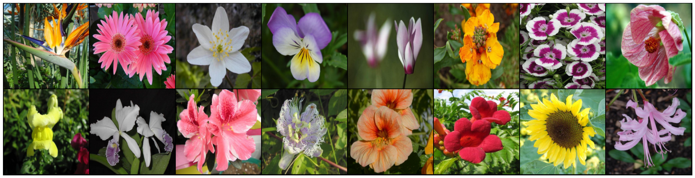

# Flower Classification

<a href= "https://huggingface.co/spaces/Chukwuka/flower_classification_uk"> Click on this link to try out Flower Classification App</a>

## Problem Statement And Description
We have created a 102 category dataset, consisting of 102 flower categories. The flowers chosen to be flower commonly occuring in the United Kingdom. Each class consists of between 40 and 258 images. Build a model to classify these flower images.

### Classification Report For the Test Dataset
<pre>

                              precision    recall  f1-score   support

            pink primrose       1.00      1.00      1.00         7
hard-leaved pocket orchid       1.00      1.00      1.00        14
         canterbury bells       1.00      1.00      1.00         8
                sweet pea       0.83      0.83      0.83        12
         english marigold       1.00      1.00      1.00        18
               tiger lily       1.00      1.00      1.00         9
              moon orchid       1.00      0.83      0.91         6
         bird of paradise       1.00      1.00      1.00        16
                monkshood       1.00      1.00      1.00        10
            globe thistle       1.00      1.00      1.00         6
               snapdragon       0.87      1.00      0.93        13
              colt's foot       1.00      1.00      1.00        12
              king protea       1.00      1.00      1.00         6
            spear thistle       1.00      1.00      1.00        11
              yellow iris       1.00      1.00      1.00         9
             globe-flower       1.00      1.00      1.00         7
        purple coneflower       1.00      1.00      1.00        17
            peruvian lily       1.00      1.00      1.00        12
           balloon flower       0.83      1.00      0.91         5
    giant white arum lily       1.00      1.00      1.00        11
                fire lily       1.00      1.00      1.00        10
        pincushion flower       1.00      1.00      1.00         7
               fritillary       1.00      1.00      1.00        16
               red ginger       1.00      1.00      1.00        12
           grape hyacinth       1.00      1.00      1.00         3
               corn poppy       1.00      1.00      1.00        10
 prince of wales feathers       1.00      1.00      1.00         7
         stemless gentian       0.92      1.00      0.96        11
                artichoke       0.94      1.00      0.97        17
            sweet william       1.00      0.94      0.97        16
                carnation       1.00      1.00      1.00         5
             garden phlox       0.88      0.88      0.88         8
         love in the mist       1.00      0.80      0.89        10
            mexican aster       1.00      0.67      0.80         3
         alpine sea holly       1.00      1.00      1.00         7
     ruby-lipped cattleya       1.00      1.00      1.00        21
              cape flower       1.00      1.00      1.00        20
         great masterwort       1.00      1.00      1.00        11
               siam tulip       1.00      1.00      1.00         7
              lenten rose       1.00      1.00      1.00        14
           barbeton daisy       1.00      1.00      1.00        32
                 daffodil       1.00      1.00      1.00        12
               sword lily       1.00      0.96      0.98        26
               poinsettia       1.00      1.00      1.00        18
         bolero deep blue       1.00      1.00      1.00         7
               wallflower       1.00      1.00      1.00        46
                 marigold       1.00      1.00      1.00        14
                buttercup       1.00      1.00      1.00        17
              oxeye daisy       1.00      1.00      1.00         8
         common dandelion       0.95      1.00      0.97        18
                  petunia       1.00      0.93      0.96        55
               wild pansy       1.00      1.00      1.00        12
                  primula       1.00      1.00      1.00        28
                sunflower       1.00      1.00      1.00        14
              pelargonium       1.00      1.00      1.00        16
       bishop of llandaff       1.00      1.00      1.00        20
                    gaura       1.00      1.00      1.00        19
                 geranium       1.00      1.00      1.00        22
            orange dahlia       1.00      1.00      1.00        14
       pink-yellow dahlia       1.00      1.00      1.00        21
         cautleya spicata       1.00      1.00      1.00        10
         japanese anemone       1.00      1.00      1.00        15
         black-eyed susan       1.00      1.00      1.00        11
               silverbush       1.00      1.00      1.00        14
        californian poppy       1.00      1.00      1.00        16
             osteospermum       0.92      1.00      0.96        12
            spring crocus       1.00      1.00      1.00         9
             bearded iris       1.00      1.00      1.00         9
               windflower       1.00      1.00      1.00         7
               tree poppy       1.00      1.00      1.00        15
                  gazania       1.00      1.00      1.00        19
                   azalea       0.95      1.00      0.98        20
               water lily       1.00      1.00      1.00        46
                     rose       0.96      1.00      0.98        43
              thorn apple       1.00      1.00      1.00        16
            morning glory       0.95      1.00      0.98        20
           passion flower       0.98      1.00      0.99        52
              lotus lotus       1.00      0.95      0.98        21
                toad lily       1.00      1.00      1.00         8
                anthurium       1.00      1.00      1.00        17
               frangipani       1.00      1.00      1.00        35
                 clematis       1.00      0.96      0.98        26
                 hibiscus       1.00      1.00      1.00        24
                columbine       0.94      1.00      0.97        17
              desert-rose       1.00      1.00      1.00        14
              tree mallow       0.78      1.00      0.88         7
                 magnolia       1.00      0.92      0.96        13
                 cyclamen       1.00      1.00      1.00        31
               watercress       1.00      1.00      1.00        46
               canna lily       1.00      1.00      1.00        13
              hippeastrum       1.00      1.00      1.00        17
                 bee balm       1.00      0.91      0.95        11
                ball moss       0.89      1.00      0.94         8
                 foxglove       1.00      1.00      1.00        28
            bougainvillea       1.00      1.00      1.00        23
                 camellia       0.94      1.00      0.97        17
                   mallow       1.00      0.86      0.92        14
          mexican petunia       1.00      0.93      0.96        14
                 bromelia       1.00      1.00      1.00        16
           blanket flower       1.00      1.00      1.00        16
          trumpet creeper       1.00      1.00      1.00        11
          blackberry lily       1.00      1.00      1.00        13

                 accuracy                           0.99      1637
                macro avg       0.99      0.98      0.98      1637
             weighted avg       0.99      0.99      0.99      1637

</pre>

**Training and Validation Plot**

**Some wrongly predicted Images**

Check out the configuration reference at https://huggingface.co/docs/hub/spaces-config-reference